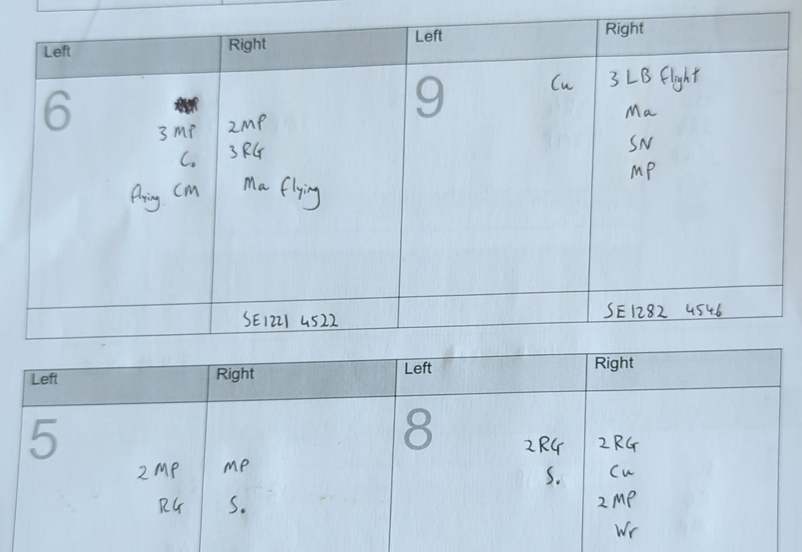
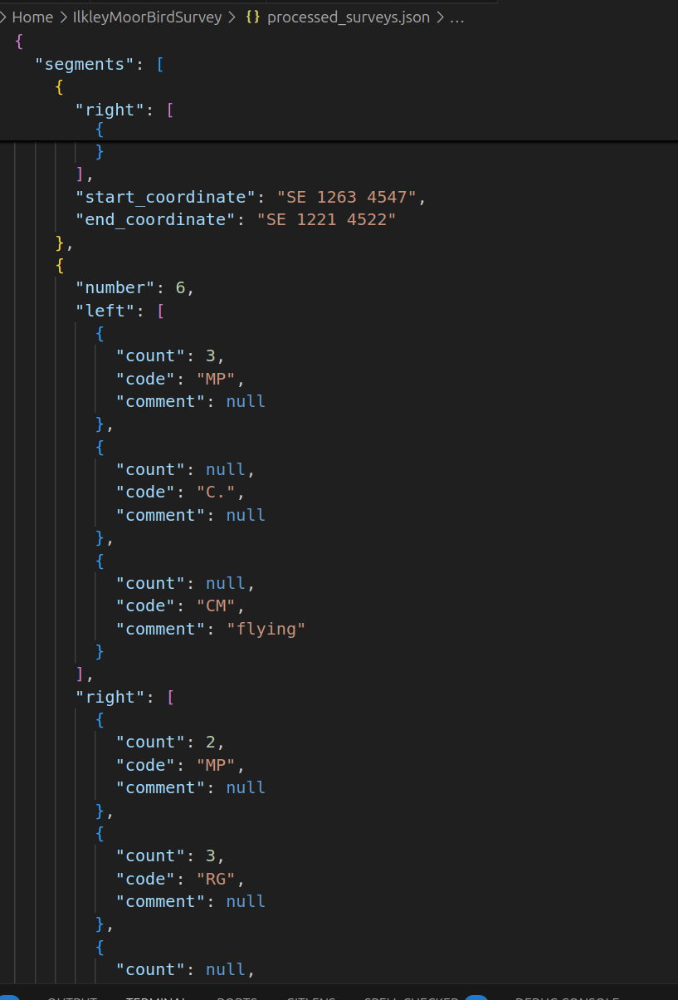
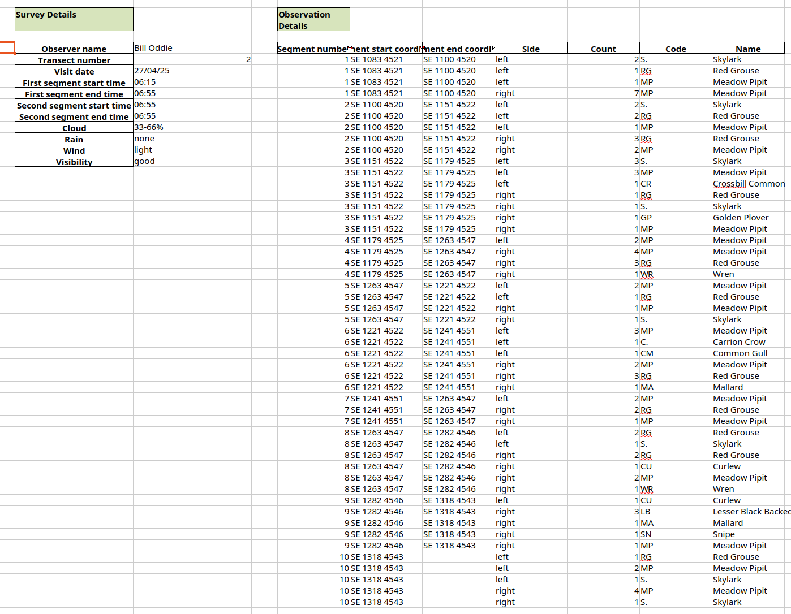

# Bird Survey

Uses a LLM (Google Gemini) to process hand-written bird survey forms (scanned PDFs) into a spreadsheet, via a json schema:





Requires a .env file with a model and API key, e.g.

```
GEMINI_MODEL=gemini-2.5-flash-preview-04-17
GEMINI_API_KEY=<your-api-key>
```

To run:
```
python process.py <path-to-pdfs>
```

